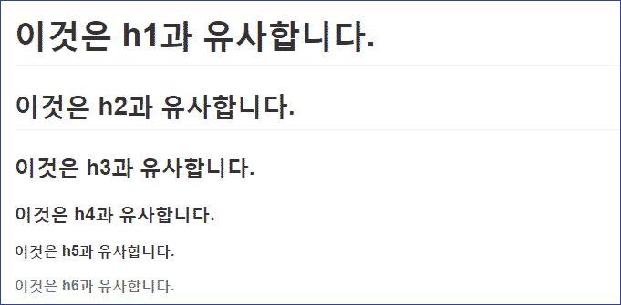

# 1.텍스트 관련 문법

## 1.1 제목 강조(Headers)
Html의 h1~h6와 유사한 문서의 제목등을 강조할 때는 # ~ ###### 처럼 맨앞에 #의 갯수로 조절합니다.

### 사용 방법
```
# 이것은 h1과 유사합니다.
## 이것은 h2과 유사합니다.
### 이것은 h3과 유사합니다.
#### 이것은 h4과 유사합니다.
##### 이것은 h5과 유사합니다.
###### 이것은 h6과 유사합니다.
```

### 실행 결과 


## 1.2 문장의 중간을 강조 방법 (bold와 italic)
문장의 중간에 강조하는 방법이 두가지가 있는데 **두껍게(Bold)** 하는 방법과 *기울리기(italic)*의 방법이 있습니다.

### 사용 방법
```
별표 한개로 강조할 문자를 감싸면 *기울림꼴*이 됩니다.
언더바 한개를 사용해도 _기울림꼴_로 만들 수 있습니다.
별표 두개로 강조할 문자를 감싸면 **두껍게** 됩니다.
언더바 한개를 사용해도 __두껍게__ 만들 수 있습니다.
_그리고  **이 두가지를** 섞어서 _ 사용할 수 있습니다.
```

### 실행 결과
별표 한개로 강조할 문자를 감싸면 *기울림꼴*이 됩니다.
언더바 한개를 사용해도 _기울림꼴_로 만들 수 있습니다.
별표 두개로 강조할 문자를 감싸면 **두껍게** 됩니다.
언더바 한개를 사용해도 __두껍게__ 만들 수 있습니다.
**그리고  _이 두가지를_ 섞어서* 사용할 수도 있습니다.

## 1.3 취소선(Strike) 사용
문장 중간에 ~~취소선을~~ 넣을 수 있습니다.

### 사용 방법
```
물결 두개로 취소할 문자들을 감싸면 ~~취소선~~이 생깁니다.
```

### 실행 결과
물결 두개로 취소할 문자들을 감싸면 ~~취소선~~이 생깁니다.

## 1.4 하이퍼링크(Link)를 거는 방법
문서 중간에 `http://~`의 링크를 파악하면 자동으로 걸리기는 하지만 텍스트로 변환하여 걸수도 있습니다.

### 사용 방법
```
[여기를 클릭](http://sbsoft.kr)하면 제 홈페이지로 이동하지요 :)
```

### 실행 결과
[여기를 클릭](http://sbsoft.kr)하면 제 홈페이지로 이동하지요 :)

----------
### [목차로 돌아가기](./README.md)
