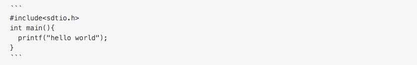
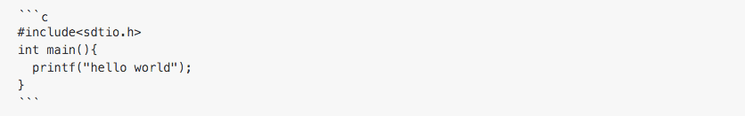

# 2.텍스트 관련 문법 두번째

## 2.1 인용구 (Quote)
다른 문구나 외부를 참고할떄 사용하라는 목적으로 만든 인용구를 사용할 수 있습니다.
인용구로 적은 부분은 왼쪽에 라인이 생기며 글자색이 회색으로 변경됩니다.

### 사용 방법
```
> 여기에 인용된 문구를 적습니다
```

### 실행 결과 
> 여기에 인용된 문구를 적습니다

## 2.2 코드 블럭
프로그램 소스 코드를 입력하다보면 다양한 기호 때문에 원치않는 내용이 출력 될수 있습니다.
이 방법을 사용하면 입력된 문자열 그대로를 사용합니다.
단, `작은 따옴표 기호`가 아님에 주의하세요. 숫자 1키 옆에 있는 기호입니다.

### 사용 방법


### 실행 결과 
```
#include<stdio.h>
int main(){
  printf("hello world");
}
```

#### 2.2+ 프로그래밍 구문 강조
프로그래밍 언어별 Syntax를 강조해 주는 기능도 있습니다.
첫번쨰 라인 기호 바로 뒤에 강조할 프로그래밍 언어를 적어 줍니다.

### 사용 방법


### 실행 결과 
```c
#include<stdio.h>
int main(){
  printf("hello world");
}
```

##### :information_source: 강조되는 언어 목록은 다음 링크를 참고해 주세요
- https://github.com/github/linguist/blob/master/lib/linguist/languages.yml
- https://github.com/github/linguist/tree/master/samples


## 2.3 문장 중간 코드 블럭
위와 같은 코드 블럭을 중간 중간에도 사용합니다.
깃허브를 보시면 `Ctrl+A`와 같이 단축키에도 많이 쓰입니다.

### 사용 방법
```
문구 중간에도 사용이 `이렇게 하면` 가능합니다.
```

### 실행 결과 
문구 중간에도 사용이 `이렇게 하면` 가능합니다.

----------
### [목차로 돌아가기](./README.md)
